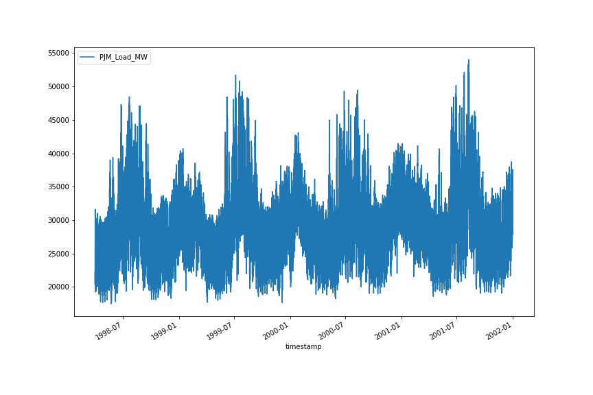
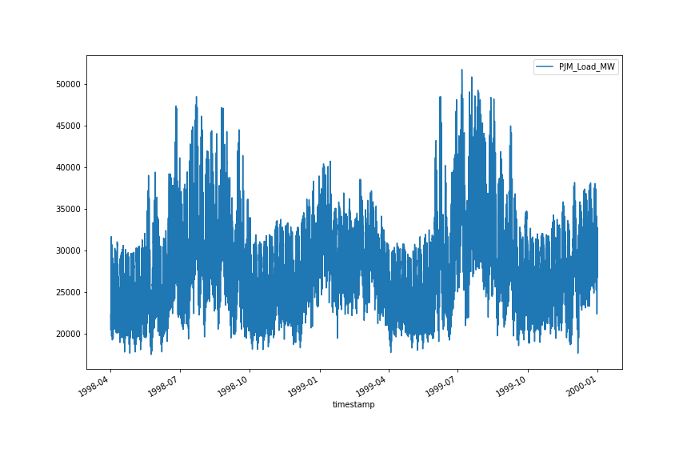
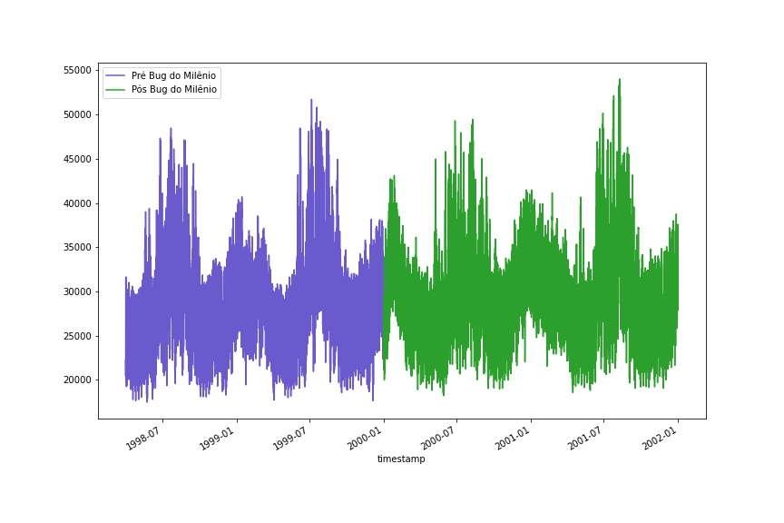

## Dados

Para essa seção, vamos usar os dados de consumo de energia da [PJM](https://www.pjm.com/), uma companhia de energia dos EUA. Os
dados foram adquiridos no [Kaggle](https://www.kaggle.com/robikscube/hourly-energy-consumption).

A PJM Interconnection LLC (PJM) é uma organização de transmissão regional (RTO) nos Estados Unidos. É parte da rede de interconexão oriental que opera um sistema de transmissão elétrica que atende toda ou parte de Delaware, Illinois, Indiana, Kentucky, Maryland, Michigan, Nova Jersey, Carolina do Norte, Ohio, Pensilvânia, Tennessee, Virgínia, Virgínia Ocidental e o distrito de Columbia.

Os dados de consumo de energia por hora vêm do site da PJM e estão em megawatts (MW).
As regiões mudaram ao longo dos anos, então os dados podem aparecer apenas para certas datas por região.
## Datas e Tempo no Python

O Python pode ser muito flexível sobre como ele interpreta 'strings' que no caso podem ser consideradas uma data, tempo, ou os dois combinados. No entanto, precisamos explicar para o Python como as diferentes partes da data ou tempo são representadas em sua 'string'. Você pode fazer isso criando um `format`. Em um `format`, diferentes caracteres precedidos pelo caracter de `%` funcionam como variáveis para as partes da data/tempo. Por exemplo, o caracter `%Y` representa o ano formatado em um dígito de 4 números, como 2014.

Uma lista completa dos caracteres utilizados e o que eles representam podem ser encontrados na documentação do Python do módulo [`datetime`](https://docs.python.org/pt-br/3/library/datetime.html#strftime-and-strptime-behavior).

Existe uma função `today()` que permite pegar a data e tempo atual.
Por padrão, isso é representado em um formato similar ao da [ISO 8601](https://pt.wikipedia.org/wiki/ISO_8601).

Para usarmos as funções de data e tempo precisamos importar o módulo `datetime`.

```python
from datetime import datetime

hoje = datetime.today()
print("ISO 8601:", hoje)
print(type(hoje))
```


Podemos usar nossa própria formatação. Por exemplo, se quisermos palavras invés de números e o ano com 4 dígitos no fim, podemos usar o seguinte:

```python
formato = "%a %b %d %H:%M:%S %Y"

hoje_fmt = hoje.strftime(formato)
print("strftime:", hoje_fmt)
print(type(hoje_fmt))

data_hoje = datetime.strptime(hoje_fmt, formato)
print("strptime:", data_hoje.strftime(formato))
print(type(data_hoje))
```

`strftime` converte um objeto datetime para uma string e `strptime` cria um objeto date time de uma string.
Quando você os imprime usando a mesma string de formatação, parecem a mesma coisa.

Quando lemos um arquivo com informação de data e tempo, elas são carregadas como uma string. Antes de podermos usar as datas, precisamos convertê-las para objetos do tipo `date` do Python.

Na string de formatação que usamos abaixo, os caracteres `-` e `:` são somente isso, caracteres na string representando a data e o tempo. Somente os caracteres que são precedidos por `%` tem um significado especial.

Tendo convertido as strings para objetos datetime, existe uma variedade de métodos que podemos usar para extrair os diferentes componentes de data/tempo.

```python
import pandas as pd
from datetime import datetime

# Carregue os dados
df = pd.read_csv("data/PJM_load_hourly")

# Selecione o primeiro registro
timestamp = df.iloc[0, 0]

# Crie um objeto datetime com o formato correto
formato = "%Y-%m-%d %H:%M:%S"
timestamp = datetime.strptime(timestamp, formato)

# Extraindo componentes individuais
print(timestamp.date().year)
print(timestamp.time().second)
```

## Datas e tempo com Pandas

Essa maneira é como fazemos com o Python base. No entanto, o Pandas torna esse processo muito mais fácil. Observe a coluna `"timestamp"` desse DataFrame:

```python
df["timestamp"]
```

~~~
0        1998-12-31 01:00:00
1        1998-12-31 02:00:00
2        1998-12-31 03:00:00
3        1998-12-31 04:00:00
4        1998-12-31 05:00:00
                ...         
32891    2001-01-01 20:00:00
32892    2001-01-01 21:00:00
32893    2001-01-01 22:00:00
32894    2001-01-01 23:00:00
32895    2001-01-02 00:00:00
Name: timestamp, Length: 32896, dtype: object
~~~
{: .output}

Podemos ver que é uma coluna do tipo (`dtype`) `object`. Essa é a forma que o Pandas chama as strings. Para podermos manipular a coluna como uma data/tempo, precisamos convertê-la para o tipo `datetime`. No entanto, o Pandas faz isso
facilmente para nós, com a função `pd.to_datetime()`

```python
print("Tipo da coluna 'timestamp':", df["timestamp"].dtype)
print("Convertendo para datetime...")
df["timestamp"] = pd.to_datetime(df["timestamp"])
print("Tipo da coluna 'timestamp':", df["timestamp"].dtype)
```

## Aritmética com Dados

É possível fazer aritmética com datas. O resultado é um objeto do tipo `Timedelta`:

```python
data_inicio = df.loc[0, "timestamp"]
data_fim = df.loc[500, "timestamp"]
diferenca_tempo = data_inicio - data_fim
print(diferenca_tempo)
print(type(diferenca_tempo))
print(diferenca_tempo.days)
```

~~~
Timedelta('19 days 04:00:00')
~~~
{: .output}

> ## Contando os Dias
> Usando a aritmética de dados, conte quantos **dias** de diferença existem entre as entradas
> `1242` e `5734` do DataFrame. Qual é a diferença total? Incluindo horas?
> > ## Solução
> > ```python
> > data_inicio = df.loc[1242, "timestamp"]
> > data_fim = df.loc[5734, "timestamp"]
> > diferenca_tempo = data_inicio - data_fim
> > print("Diferença total:", diferenca_tempo)
> > print("Diferença em dias:", diferenca_tempo.days)
> > ```
> > ~~~
> > Diferença total: 186 days 19:00:00
> > Diferença em dias: 186
> > ~~~
> > {: .output}
> {: .solution}
{: .challenge}

## Plotando Séries Temporais

Uma que vez temos colunas do tipo `datetime`, elas podem ser usadas para criar plots
do tipo série temporal. Podemos usar o método de plotagem do DataFrame Pandas:

```python
df.plot(x="timestamp", y="PJM_Load_MW", figsize=(12,8))
```



Também podemos usar datas para filtrar o DataFrame. Digamos que queremos
todos os registros ANTES do ano 2000. Podemos filtrar da seguinte forma:

```python
filtro_data = df["timestamp"] < "2000-01-01"
df[filtro_data].plot(x="timestamp", y="PJM_Load_MW", figsize=(12,8))
```


Podemos tomar vantagem disso para plotar períodos específicos, por exemplo:
```python
pre_2000 = df["timestamp"] < "2000-01-01"
pos_2000 = df["timestamp"] >= "2000-01-01"
fig, ax = plt.subplots(figsize=(12,8))
df[pre_2000].plot(x="timestamp", y="PJM_Load_MW", color='slateblue', ax=ax, label="Pré Bug do Milênio")
df[pos_2000].plot(x="timestamp", y="PJM_Load_MW", color='tab:green', ax=ax, label="Pós Bug do Milênio")
```

